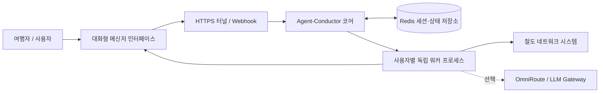

# 🚂 Agent-Conductor

> **"기차의 차장(Conductor)은 승객의 안전하고 편안한 여정을 조율하고, 오케스트라의 지휘자(Conductor)는 수많은 악기의 호흡을 모아 완벽한 하모니를 만들어냅니다."**

**Agent-Conductor**는 철도 여정을 준비하는 모든 이를 위한 **지능형 철도 여정 오케스트레이터(Autonomous Rail Journey Orchestrator)**입니다.

반복되는 화면 새로고침과 일정 확인의 피로감에서 벗어나세요. 일상의 자연스러운 대화 한마디로 원하는 열차 일정과 최적의 좌석을 지능적으로 탐색하고 확보합니다. 백그라운드 분산 프로세스, 자연어 해석 AI, 적응형 서킷 브레이커가 조화롭게 맞물려, 당신이 오직 **'여정의 설렘'**에만 온전히 집중할 수 있도록 돕습니다.

> [!NOTE]
> 본 프로젝트는 대화형 AI 인터페이스와 분산 프로세스를 결합한 **개인 Agent 설계 및 아키텍처 연구 목적**으로만 공개·활용됩니다. 연구 및 학습 목적 외의 다른 용도로 사용하여 발생하는 모든 문제와 결과에 대해 일체의 책임을 지지 않으며, 모든 이용에 따른 책임은 사용자 본인에게 있습니다.

---

## ✨ 주요 기능

- **자연어 기반 여정 파싱**: 일상 문장("내일 저녁 부산 2명")이나 직관적인 인라인 메뉴를 통한 간편한 여정 등록
- **다양한 열차 및 좌석 지원**: 고속열차(Flagship) 및 일반열차(Entry/전체), 시간대 범위, 일반실·특실 우선순위 맞춤 설정
- **유연한 인원 구성**: 성인 1~9인, 연속 좌석 또는 1석씩 개별 좌석 확보 모드 지원
- **백그라운드 지능형 좌석 탐색**: 백그라운드 워커가 빈자리를 실시간으로 감지하고 즉시 확보
- **인플라이트(In-Flight) 자연어 여정 수정**: 탐색이 실행 중인 상태에서도 별도의 메뉴 조작 없이 채팅창에 일상 문장("시간대 19시로 바꿔줘", "2명으로 변경")으로 바로 말하면 실시간으로 조건을 갱신하고 새 세션으로 즉시 재시작
- **세션 및 계정 영속성**: 열차 탐색이 종료되거나 유휴 상태여도 로그인 세션을 안전하게 보존하여 재로그인 없이 즉시 새 여정 시작 가능
- **적응형 트래픽 보호**: 요청 간격 무작위 지터, 429 쿨다운, 차단 감지 서킷 브레이커, 서버 점검 모드 자동 감지
- **선택형 AI 오류 분석**: 예외 상황 발생 시 LLM을 통한 자동 상황 분석 및 자율 복구 정책 수립

---

## 🏛️ 시스템 아키텍처



---

## 🚀 빠른 시작

### 1. 준비물

- Docker Engine & Docker Compose v2
- 메신저 API 토큰 (BotFather 발급)
- ngrok 인증 토큰 및 고정 도메인
- 철도 회원 계정
- (선택 사항) 로컬 OmniRoute 게이트웨이 또는 외부 LLM API 키 (기본 모드에서는 AI 없이도 100% 작동)

### 2. 환경 설정

```bash
git clone https://github.com/Skystar728/agent-conductor.git
cd agent-conductor
cp .env.example .env
```

`.env` 파일에서 기본 연동 정보를 설정합니다 (`NGROK_DOMAIN`은 `https://` 없이 입력):

```env
BOTTOKEN=your_messenger_token
NGROK_AUTHTOKEN=your_ngrok_auth_token
NGROK_DOMAIN=your-domain.ngrok-free.app

# 접근을 허용할 휴대전화번호 (비워둘 시 전체 허용)
ALLOW_LIST=010-1234-5678

# AI 게이트웨이 설정 (기본값: none - AI 없이 결정론적 안전 모드로 동작)
AI_GATEWAY=none

# 표준 OpenAI SDK 호환 LLM 설정 (OpenAI, Ollama, vLLM, OmniRoute 등 모든 OpenAI 호환 엔드포인트 지원)
# AI_GATEWAY=openai (또는 omniroute)
# OPENAI_API_KEY=your_openai_or_gateway_key
# OPENAI_BASE_URL=https://api.openai.com/v1
# OPENAI_MODEL=gpt-4o-mini

# Redis 보안 설정 (선택: 지정 시 Redis 컨테이너 인증 활성화)
# REDIS_PASSWORD=your_secure_password
```

### 3. 컨테이너 실행

#### A. 코어 모드 (AI 없이 실행 - 권장)
별도의 AI 게이트웨이나 API 키 없이도 지능형 지터와 서킷 브레이커 기반으로 완벽하게 동작합니다.

```bash
docker compose up -d --build
```

#### B. 표준 OpenAI API / 외부 LLM 연동 모드
OpenAI 또는 OpenAI API 규격을 지원하는 서비스(Groq, Ollama, DeepSeek 등)를 직접 사용할 수 있습니다:
1. `.env`에 설정 추가:
   ```env
   AI_GATEWAY=openai
   OPENAI_API_KEY=sk-...
   OPENAI_BASE_URL=https://api.openai.com/v1
   OPENAI_MODEL=gpt-4o-mini
   ```
2. 컨테이너 실행:
   ```bash
   docker compose up -d --build
   ```

#### C. 로컬 OmniRoute AI 게이트웨이 연동 모드 (자체 호스팅)
내장된 OmniRoute 멀티 프로바이더 라우터를 컨테이너로 함께 기동하여 자체 LLM이나 무료 모델로 오류 분석 및 HITL(Human-In-The-Loop)을 사용하려면:

1. OmniRoute 환경 파일 준비:
   ```bash
   cp .env.omniroute.example .env.omniroute
   ```
2. 아래 명령어로 시크릿 키들을 생성하여 `.env.omniroute`에 입력합니다:
   ```bash
   openssl rand -base64 48  # JWT_SECRET
   openssl rand -hex 32     # API_KEY_SECRET
   openssl rand -hex 32     # STORAGE_ENCRYPTION_KEY
   openssl rand -base64 48  # OMNIROUTE_WS_BRIDGE_SECRET
   ```
3. `.env.omniroute`의 `INITIAL_PASSWORD`에 대시보드 관리자 비밀번호를 설정합니다.
4. `.env` 파일에서 `AI_GATEWAY=omniroute`로 변경합니다.
5. OmniRoute 프로파일을 포함하여 실행:
   ```bash
   docker compose --profile omniroute up -d --build
   ```
6. 웹 브라우저에서 `http://localhost:20128`에 접속하여 `admin`과 설정한 `INITIAL_PASSWORD`로 로그인합니다.
7. 대시보드에서 원하는 Upstream Provider(OpenAI, Anthropic, Google, Ollama 등)를 연결하고 활성화된 모델명을 `.env`의 `OPENAI_MODEL`에 지정합니다.

### 4. 웹훅 등록

컨테이너 기동 후 아래 명령을 통해 웹훅을 연동합니다:

```bash
docker compose exec app python -c 'import os, requests; t=os.environ["BOTTOKEN"]; d=os.environ["NGROK_DOMAIN"]; print(requests.post(f"https://api.telegram.org/bot{t}/setWebhook", data={"url": f"https://{d}/telebot"}, timeout=10).json())'
```

웹훅 등록 응답으로 `{"ok": true, ...}`가 출력되면 연동이 완료된 것입니다.

---

## 💬 조율 명령어 (Commands)

### 🗣️ 실행 중 실시간 자연어 수정 (In-Flight Modification)
여정 탐색이 백그라운드에서 실행 중일 때, 번거로운 메뉴 조작이나 `/edit` 명령 없이도 채팅창에 변경할 내용을 일상 대화로 입력하면 Conductor가 즉시 새로운 조건으로 탐색을 재시작합니다:
- *"시간대 19시로 바꿔줘"* ➔ 출발 시각 19:00으로 즉시 변경 및 재시작
- *"2명으로 변경해줘"* ➔ 탐색 인원 2명으로 즉시 변경 및 재시작
- *"내일로 날짜 변경"* ➔ 출발일을 내일 날짜로 갱신 및 재시작
- *"특실로 바꿔줘"* ➔ 좌석 옵션을 특실 우선으로 즉시 변경
- *"1석씩 따로 앉기로 변경"* ➔ 좌석 배치를 랜덤/개별 모드로 전환

### 여정 조율 명령

| 명령어 | 설명 |
|---|---|
| `/start` | 새로운 여정 조율 시작 (저장된 계정 보존 시 즉시 일정 입력 가능) |
| `/cancel` | 진행 중인 대화 및 백그라운드 탐색 취소 |
| `/status` | 현재 사용자의 여정 탐색 상태, 계정, 조건 실시간 확인 |
| `/edit` | 진행 중인 여정의 설정 필드별 수동 수정 메뉴 |
| `/seat 1` | 연속 좌석 확보 모드로 즉시 변경 |
| `/seat 2` | 1석씩 개별 좌석 확보 모드로 변경 |
| `/help` | 사용 안내 및 가이드 확인 |

*관리자 기능: 여정 시작 시 `"마스터로그인"`(또는 `"관리자로그인"`)을 입력하면 환경변수 계정으로 즉시 자동 로그인되며, 원격 관리자 명령(`/admin`, `/subscribe`, `/allusers`, `/cancelall`, `/broadcast`, `/flushredis`, `/debug_on`, `/debug_off`)은 관리자 인증 후 이용할 수 있습니다.*

---

## 🛡️ 안정성 및 트래픽 보호 체계

Agent-Conductor는 과도한 부하를 유발하지 않도록 다양한 보호 메커니즘을 내장하고 있습니다.

| 상황 | 지능형 대응 동작 |
|---|---|
| **정상 조회** | `3.0~5.5초` 범위의 무작위 지터(Jitter)를 적용하여 고정 주기로 인한 탐지 패턴을 완화합니다. *(패턴 완화 시도이며 원천 차단 방지를 보장하지는 않으므로 과도한 요청은 자제해야 합니다)* |
| **일시적 트래픽 혼잡 (429)** | `10초` 쿨다운 후 안전하게 재시도 |
| **차단 의심 응답 (403)** | `180초` 서킷 브레이커 발동 후 사용자 알림 전송 |
| **연속 차단 감지** | 원격 세션 안전 정리 및 프로세스 즉시 종료 (계정 보호) |
| **정기 점검 시간** | `180~300초` 완만한 인터벌로 상태 점검 후 정상화 시 자동 재개 |

---

## ⚙️ 운영 및 트래픽 튜닝 환경변수

필요에 따라 `.env`에서 다음 변수들을 조절하여 운영 환경에 맞게 최적화할 수 있습니다:

| 환경변수 | 기본값 | 설명 |
|---|---:|---|
| `TRAIN_SEARCH_MIN_INTERVAL` | `3.0` | 최소 탐색 주기(초). 고정 주기 완화를 위한 지터 하한값 (구 `KORAIL_SEARCH_MIN_INTERVAL` 호환) |
| `TRAIN_SEARCH_MAX_INTERVAL` | `5.5` | 최대 탐색 주기(초). 지터 상한값 (구 `KORAIL_SEARCH_MAX_INTERVAL` 호환) |
| `RATE_LIMIT_COOLDOWN_SECONDS` | `10` | HTTP 429 또는 일시 트래픽 혼잡 응답 시 대기 시간(초) |
| `WAF_COOLDOWN_SECONDS` | `180` | HTTP 403 / 방화벽 제한 감지 시 1차 서킷 브레이커 대기 시간(초) |
| `WAF_MAX_CONSECUTIVE_BLOCKS` | `2` | 연속 차단 감지 시 프로세스 강제 보호 종료 기준 횟수 |
| `MAINTENANCE_CHECK_MIN_INTERVAL` | `180` | 서버 정기 점검 시 상태 프로브 최소 대기 주기(초) |
| `MAINTENANCE_CHECK_MAX_INTERVAL` | `300` | 서버 정기 점검 시 상태 프로브 최대 대기 주기(초) |
| `PAYMENT_TIMEOUT_MINUTES` | `10` | 승차권 확보 후 결제 리마인더 만료 제한 시간(분) |
| `PAYMENT_REMINDER_INTERVAL` | `30` | 결제 리마인더 확인 및 알림 주기(초) |
| `REDIS_PASSWORD` | 빈 값 | Redis 인증 비밀번호 (설정 시 컨테이너에 `--requirepass` 적용) |
| `ENCRYPTION_KEY` | 빈 값 | `train_pw` 암호화용 사용자 정의 Fernet 키 (미설정 시 봇 토큰에서 파생) |

---

## 🧪 테스트 및 품질 검증

본 프로젝트는 단위, 통합, E2E를 아우르는 200여 개의 테스트 스위트를 포함하고 있습니다:

```bash
# 단위 테스트 실행 (142개 전수 통과, 외부망 불필요)
docker compose exec app pytest tests/unit -q
# 또는
make test-unit

# 통합 테스트 실행 (Redis 및 웹훅 연동 검증)
docker compose exec app pytest tests/integration -q
# 또는
make test-integration

# 종단간(E2E) 시나리오 테스트 실행
docker compose exec app pytest tests/e2e -q
# 또는
make test-e2e

# 전체 테스트 스위트 일괄 실행
docker compose exec app pytest -q
# 또는
make test
```

---

## 📂 프로젝트 구조

```text
.
├── docker-compose.yml
├── Dockerfile
├── .env.example
├── .env.omniroute.example
├── src/
│   ├── app.py                  # 엔트리포인트 및 서비스 조율
│   ├── api/                    # Webhook 엔드포인트 및 콜백 라우팅
│   ├── config/                 # 환경 설정 및 파라미터 로더
│   ├── handlers/               # 대화 흐름 제어 및 상태 머신
│   ├── models/                 # 세션 및 여정 도메인 엔티티
│   ├── services/               # 철도 인터페이스, 좌석 탐색기, AI 서비스
│   ├── storage/                # Redis 기반 분산 저장소
│   ├── telegramBot/            # 백그라운드 탐색 워커 프로세스
│   └── utils/                  # 암호화(Fernet/AES), 로깅, 유효성 검증
└── tests/
    ├── unit/                   # 142개 단위 테스트 스위트
    ├── integration/            # 65개 통합 테스트 스위트
    └── e2e/                    # 7개 종단간 테스트 스위트
```

---

## 🤝 Credits

- 본 프로젝트는 [GeunSam2/korail_KTX_macro_telegrambot](https://github.com/GeunSam2/korail_KTX_macro_telegrambot)의 초기 구조를 기반으로 개발되었습니다.
- [carpedm20/korail2](https://github.com/carpedm20/korail2)
- [diegosouza/omniroute](https://github.com/diegosouza/omniroute)
- [redis/redis](https://github.com/redis/redis)
- [pallets/flask](https://github.com/pallets/flask)
